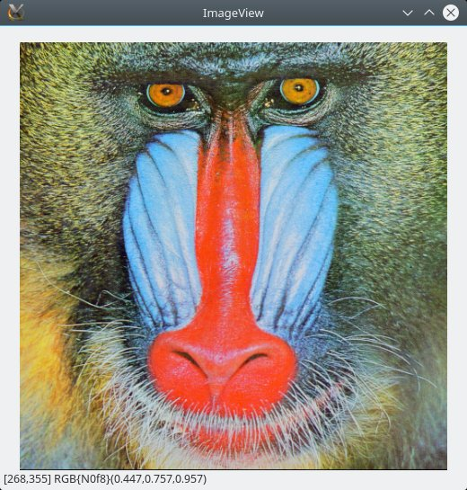
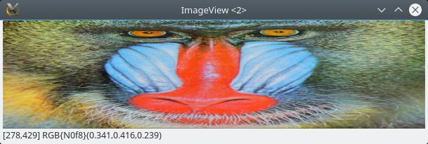
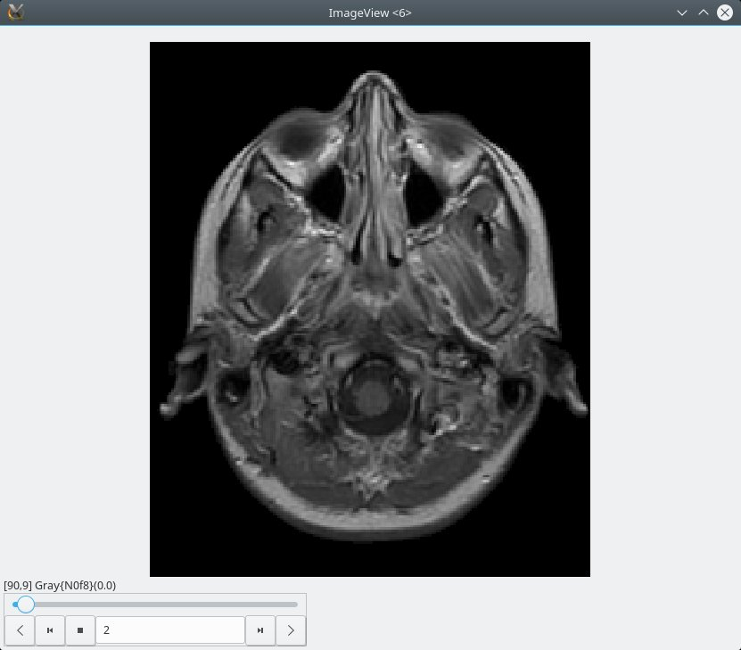
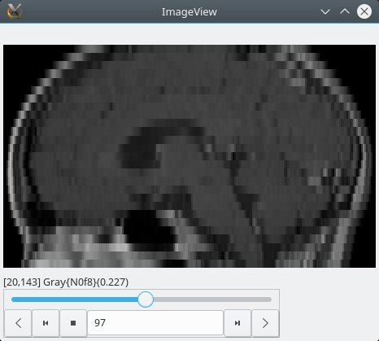
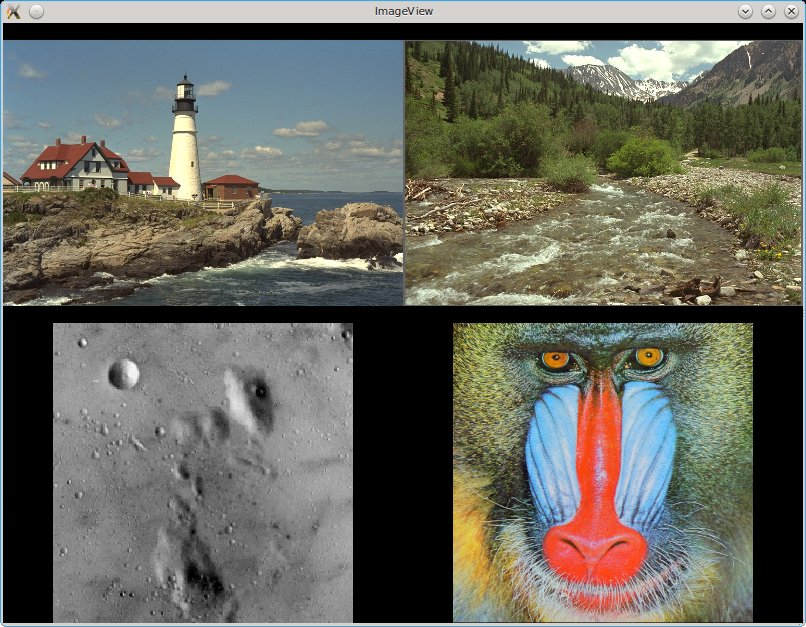
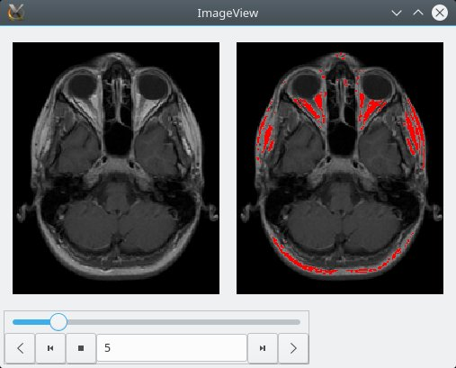

# ImageView.jl

An image display GUI for [Julia](http://julialang.org/).

## Installation

To install the `ImageView` package:

```julia
Pkg.add("ImageView")
```

## Preparation

First let's try it with a photograph. If you have an image on your computer, load it this way:

```julia
using ImageView, Images
img = load("my_photo.jpg")
```

Any typical image format should be fine, it doesn't have to be a jpg. The [`TestImages`](https://github.com/timholy/TestImages.jl) package contains several standard images:

```julia
using TestImages
img = testimage("mandrill")
```

## Demonstration of the GUI

For simplicity, you should first test ImageView at the REPL prompt or in an IDE;
script usage is discussed later below.

You can view the image using `imshow`:

```julia
imshow(img)
```
You should get a window with your image:



You can use `imshow()` if you want to choose an image using a file
dialog.

Try resizing the image window by dragging one of its corners; you'll
see that the aspect ratio of the image is preserved when you
resize. If instead you want the image to fill the pane, try
`imshow(img, aspect=:none)`. Here's a comparison of the two:

| aspect=:auto (default) | aspect=:none |
|:----------------------:|:------------:|
|  |  |


Next, Ctrl-click and drag somewhere inside the image.  You'll see the
typical rubberband selection, and once you let go the image display
will zoom in on the selected region.  Again, the aspect ratio of the
display is preserved.  If you click on the image without holding down
Ctrl, you can drag the image to look at nearby
regions. Ctrl-double-click on the image to restore the full region.

If you have a wheel mouse, zoom in again and scroll the wheel, which should cause the image to pan vertically.
If you scroll while holding down Shift, it pans horizontally; hold down Ctrl and you affect the zoom setting.
Note as you zoom via the mouse, the zoom stays focused around the mouse pointer location, making it easy to zoom in on some small feature simply by pointing your mouse at it and then Ctrl-scrolling.

You can view the image upside-down with

```julia
imshow(img, flipy=true)
```
(`flipx` flips the image horizontally) or switch the horizontal and vertical axes with

```julia
imshow(img, axes=(2,1)).
```

For movies, 3D, and 4D images, ImageView will create a "player" widget.

```julia
img = testimage("mri")
imshow(img)
```

The `"mri"` image is an [AxisArray](https://github.com/JuliaArrays/AxisArrays.jl), and consequently you can select axes by name:

```julia
imshow(img, axes=(:S, :P), flipy=true)  # a sagittal plane (Superior, Posterior)
```

| `imshow(img)` | `imshow(img, axes=(:S, :P), flipy=true)` |
|:-------------:|:----------------------------------------:|
|  |  |


Finally, for grayscale images, right-clicking on the image yields a brightness/contrast GUI:


You can adjust the contrast by adjusting the sliders or by entering
values into the text boxes.

## Programmatic usage

### Simple command-line utilities

`ImageView.closeall()` closes all open windows.

You can place multiple images in the same window using `canvasgrid`:
```
using ImageView, TestImages, Gtk.ShortNames
grid, frames, canvases = canvasgrid((1,2))  # 1 row, 2 columns
imshow(canvases[1,1], testimage("lighthouse"))
imshow(canvases[1,2], testimage("mandrill"))
win = Window(grid)
Gtk.showall(win)
```



### The dictionary and region-of-interest manipulations

`imshow` returns a dictionary containing a wealth of information about
the state of the viewer. Perhaps most interesting is the `"roi"`
entry, which itself is another dictionary containing information about
the current selected region or interest. These are
[Reactive signals](https://juliagizmos.github.io/Reactive.jl/), and consequently you can even manipulate the
state of the GUI by `push!`ing new values to these signals.

For example, using the `"mri"` image above, you can select the 5th slice with
```julia
guidict = imshow(img)
push!(guidict["roi"]["slicedata"].signals[1], 5)
```

`SliceData` objects contain information about which axes are displayed
and the current slice indices of those axes perpendicular to the view
plane. Likewise, `"image roi"` contains the actual image data
currently being shown in the window (including all zoom/slice
settings).

The `"zoom"`- and `"pan"`-related signals originate from
[GtkReactive](https://juliagizmos.github.io/GtkReactive.jl/stable/),
and users should see the documentation for that package for more
information.

### Coupling two or more images together

`imshow` allows you to pass many more arguments; please use `?imshow`
to see some of the options. We can use these extra arguments to couple
the zoom and slice regions between two images. Let's make a "fake" image encoding the segmentation of an image:

```julia
using ImageView, GtkReactive, TestImages, Colors

# Prepare the data
mri = testimage("mri")
mriseg = RGB.(mri)
mriseg[mri .> 0.5] .= colorant"red"
```

Now we display the images:

```julia
guidata = imshow(mri, axes=(1,2))
zr = guidata["roi"]["zoomregion"]
slicedata = guidata["roi"]["slicedata"]
imshow(mriseg, nothing, zr, slicedata)
```

Here we used `imshow` to create the first window, and then extracted
the `zoomregion` and `slicedata` information from that display and
used them to intialize a second window with the second image. If you
zoom, pan, or change the slice plane in one window, it makes the same
change in the other.

Alternatively, you can place both displays in a single window:
```julia
zr, slicedata = roi(mri, (1,2))
gd = imshow_gui((200, 200), slicedata, (1,2))
imshow(gd["frame"][1,1], gd["canvas"][1,1], mri, nothing, zr, slicedata)
imshow(gd["frame"][1,2], gd["canvas"][1,2], mriseg, nothing, zr, slicedata)
Gtk.showall(gd["window"])
```

You should see something like this:



## Annotations

You can add and remove various annotations to images (currently text, points, and lines).
There are two basic styles of annotation: "anchored" and "floating."
An "anchored" annotation is positioned at a particular pixel location within the image;
if you zoom or pan, the annotation will move with the image, and may not even be shown if the corresponding position is off-screen.
In contrast, a "floating" annotation is not tied to a particular location in the image,
and will always be displayed at approximately the same position within the window even if you zoom or pan.
As a consequence, "anchored" annotations are best for labeling particular features in the image,
and "floating" annotations are best for things like scalebars.

Here's an example of adding a 30-pixel scale bar to an image:
```julia
guidict = imshow(img)
scalebar(guidict, 30; x = 0.1, y = 0.05)
```

`x` and `y` describe the center of the scale bar in normalized
coordinates, with `(0,0)` in the upper left.  In this example, the
length of the scale bar is in pixels, but if you're using the
[Unitful](https://github.com/ajkeller34/Unitful.jl) package for the
image's `pixelspacing`, then you should set the length to something
like `50μm`.

The remaining examples are for fixed annotations. Here is a demonstration:

```julia
using Images, Colors, ImageView
z = ones(10,50);
y = 8; x = 2;
z[y,x] = 0
guidict = imshow(z)
idx = annotate!(guidict, AnnotationText(x, y, "x", color=RGB(0,0,1), fontsize=3))
idx2 = annotate!(guidict, AnnotationPoint(x+10, y, shape='.', size=4, color=RGB(1,0,0)))
idx3 = annotate!(guidict, AnnotationPoint(x+20, y-6, shape='.', size=1, color=RGB(1,0,0), linecolor=RGB(0,0,0), scale=true))
idx4 = annotate!(guidict, AnnotationLine(x+10, y, x+20, y-6, linewidth=2, color=RGB(0,1,0)))
idx5 = annotate!(guidict, AnnotationBox(x+10, y, x+20, y-6, linewidth=2, color=RGB(0,0,1)))
delete!(guidict, idx)
```

#### Annotation API
```
AnnotationText(x, y, str;
               z = NaN, t =  NaN,
               color = RGB(0,0,0), angle = 0.0, fontfamily = "sans", fontsize = 10,
               fontoptions = "",  halign = "center", valign = "center", markup = false, scale=true)
```
Place `str` at position `(x,y)`.

Properties:

* `z` - position on z axis, for 3D images
* `t` - position on time axis, for movie-like images
* `color`
* `angle`
* `fontfamily`
* `fontsize` - font size in points
* `fontoptions`
* `halign` - "center", "left", or "right"
* `valign` - "center", "top", or "bottom"
* `markup`
* `scale` - scale the text as the image is zoomed (default: `true`)


```
AnnotationPoints([xy | xys | x, y];
                 z = NaN, t = NaN, size=10.0, shape::Char='x',
                 color = RGB(1,1,1), linewidth=1.0, linecolor=color, scale::Bool=false)
```

Annotate the point `xy`, `(x,y)`, or the points `xys`.  `xys` maybe a Vector of tuples `Vector{(Real,Real)}`, or a `2 x N` Matrix.  Points are assumed to be in `(x,y)` order. (TODO: this could be generalized, as with lines.)

Properties:

* `z` - position on z axis, for 3D images
* `t` - position on time axis, for movie-like images
* `size` - how large to draw the point
* `shape` - one of `'.'`, `'x'`, `'o'`, `'+'`, `'*'`
* `color`
* `linewidth` - width of lines used to draw the point
* `linecolor` - line color; defaults to `color`; filled circles (shape=`'.'`) can have a different outline and fill color
* `scale` - scale the drawn size of the point when the image is scaled (default: `false`)


```
AnnotationLines(line | lines | c1,c2,c3,c4;
                z = NaN, t = NaN,
                color = RGB(1,1,1), linewidth=1.0, coord_order="xyxy")
```

Draw `line`, `lines`, or the line with coordinates `(c1,c2,c3,c4)`.  `line` is specified as a tuple of point tuples, `((x1,y1),(x2,y2))`.  `lines` may be a `Vector` of such lines, or a `4 x N` matrix.  For a matrix or when specifying coordinates independently, the coordinate order is specified by `coord_order`, which defaults to "xyxy".

Properties:

* `z` - position on z axis, for 3D images
* `t` - position on time axis, for movie-like images
* `color`
* `linewidth` - width of the line(s)
* `coord_order` - for matrix or coordinate inputs, the order of the coordinates (e.g., "xyxy", "xxyy", "yyxx")


```
AnnotationBox(left, top, right, bottom | (x1,y1), (x2,y2) | bb::Graphics.BoundingBox;
              z = NaN, t = NaN,
              color = RGB(1,1,1), linewidth=1.0, coord_order="xyxy")
```

Draw a box.  Box can be specified using four values for `(left, top, right, bottom)`, as a pair of tuples, `(x1,y1),(x2,y2)`, or as a `BoundingBox`.  The coordinate order the pair of tuples may be specified by `coord_order`, which defaults to "xyxy".

Properties:

* `z` - position on z axis, for 3D images
* `t` - position on time axis, for movie-like images
* `color`
* `linewidth` - width of the lines


## Additional notes

### Calling imshow from a script file

If you call Julia from a script file, the julia process will terminate at the end of the program. This will cause any windows opened with `imshow()` to terminate, which is probably not what you intend. We want to make it only terminate the process when the image window is closed. Below is some example code to do this:

```
using Images, ImageView, TestImages, Gtk.ShortNames

img = testimage("mandrill")
guidict = imshow(img);

#If we are not in a REPL
if (!isinteractive())

    # Create a condition object
    c = Condition()

    # Get the window
    win = guidict["gui"]["window"]

    # Notify the condition object when the window closes
    signal_connect(win, :destroy) do widget
        notify(c)
    end

    # Wait for the notification before proceeding ...
    wait(c)
end
```

This will prevent the julia process from terminating immediately. Note
that if we did not call `signal_connect`, the process will keep
waiting even after the image window has closed, and you will have to
manually close it with `CTRL + C`.

If you are opening more than one window you will need to create more
than one `Condition` object, if you wish to wait until the last one is
closed.
